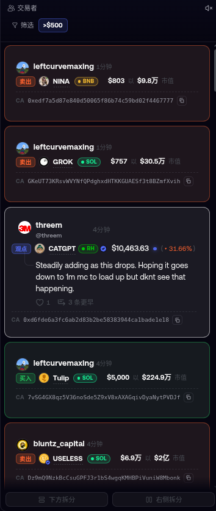
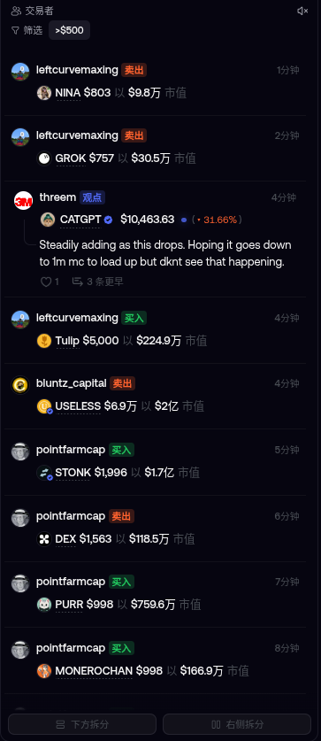

# Fomo Plus · 实时动态增强

非官方浏览器扩展（MV3）—— 优化 [fomo.family](https://fomo.family) 左侧实时动态（通知）栏。

## 对比

| 增强后 | fomo 原生 |
| --- | --- |
|  |  |

差异：每条通知成为独立卡片（买入绿框 / 卖出红框 / 观点白框），新增 @handle、链标签（SOL/ETH/BNB…）与合约地址整行 + 一键复制；头像列与正文列对齐，密度与层级一致，长币种名不再挤压。盈利与官方公告保持原生渲染。

> 与 fomo.family / Robinhood 无任何关系；仅本地展示增强，不代理任何交易行为。

## 功能

- 通知栏卡片化：买入 = 绿框，卖出 = 红框，观点 = 白框（盈利/官方公告保持原生渲染）
- 每行左对齐排版；币种行单行排布，超长币种名省略号
- @handle（来自 app 自己的流量）、链标签（SOL / ETH / BNB / BASE / MON / RH）、合约地址整行 + 一键复制（复制后 ✓ 反馈）
- 面板头部「已连接 / 连接中 / 已断开」状态点（对应 app 的实时 WS）
- 舒适 / 紧凑两种密度；popup 内可开关所有增强项，改动即时生效

## 安全性

- **不读取任何凭据**：不碰 cookie / localStorage / sessionStorage / IndexedDB；`permissions` 仅 `storage`，无 `host_permissions`
- **不发起任何网络请求**：数据完全来自 app 自己的流量镜像（`src/inject.js` 只包装页面自身的 fetch/XHR/WS，参数原样透传、只读响应）
- **无注入落点**：无 `innerHTML` / `eval` / `new Function` / `document.write`；页面数据只经 `textContent` / `setAttribute`
- 隔离世界只接收 JSON 字符串（带 `v:1` 协议号、字段白名单、64 字符长度与 200 条/事件上限）；页面对象图 / getter / 原型链不会跨越边界
- 合约地址以 **app 自己渲染的 DOM 为准**（payload 只补空缺，且必须过 40 位 EVM / 32-44 位 Solana 地址正则）；链标签取自 app 的 DOM，不采信网络数据
- 无后台脚本、无遥测、无远程代码、无第三方依赖（7 个文件，~750 行）

### 边界（务必了解）

- 插件跑在 fomo 页面自己的 JS 上下文（MAIN world），**不是安全边界**：页面或其中任何第三方脚本本来就能做同样的事；它只做展示，**不要当防钓鱼工具用**
- 合约地址复制功能仅供快速核对，抄送前后请以 app 自身的地址行核对

## 安装（未打包扩展）

### 前置

- Chrome 111+ / Edge / Brave / 其他 Chromium 内核浏览器（需支持 MV3 + `world: "MAIN"` 内容脚本；Firefox 暂不支持）
- 从仓库页点 **Code → Download ZIP** 解压，或 `git clone https://github.com/tianzeteam/fomo-plus.git`

### 步骤

1. 打开扩展管理页：地址栏输入 `chrome://extensions`（Brave/Edge 为 `brave://extensions` / `edge://extensions`）
2. 打开右上角（Edge 在左上角）的「开发者模式」开关
3. 点击「加载已解压的扩展程序」，选择**包含 manifest.json 的那个文件夹**（即仓库根目录，不是它上层；ZIP 解压后注意别套了两层）
4. 装好后建议固定到工具栏：点浏览器右上角拼图图标 → 在 Fomo Plus 旁点 📌
5. 打开 [fomo.family](https://fomo.family) 并登录（扩展不接管登录，登录仍用你自己的钱包）
6. 左侧实时动态栏即出现卡片化效果；点扩展图标打开设置面板（启用增强 / @handle / 链标签 / CA 复制 / 连接状态 / 密度），改动立即生效

### 验证安装成功

- 左栏头部最右侧出现「● 已连接 / 连接中」状态点
- 动态卡片左下角出现 `CA 0x…` 行和复制图标

### 更新与卸载

- 改代码后：`chrome://extensions` → 在 Fomo Plus 卡片上点 ↻，再刷新 fomo 页面
- 完全卸载：扩展页 → Fomo Plus → 「移除」（设置随之清除）
- 本扩展为未打包扩展，浏览器**不会自动更新**；更新请拉取新代码后点刷新。担心文件被动过，可用仓库里自带的 `baseline.md5` 运行 `md5sum -c baseline.md5` 自检

### 常见问题

- **列表没变化**：确认扩展已在 `brave://extensions` 里启用，且卡片样式开关（popup → 启用增强）开着；仍无效果就刷新页面
- **没有 @handle / 链标签**：数据只来自 app 自己的请求；刚打开页面几秒内没数据属正常，或该行在 API 里没有 handle
- **「已连接」一直显示「连接中」**：说明 app 自己的实时通道没连上（与扩展无关），可刷新页面试试
## 发布到 Chrome Web Store

1. **注册开发者账号**：[Chrome Web Store 开发者信息中心](https://chrome.google.com/webstore/devconsole) 用 Google 账号登录，一次性缴纳 **US$5 注册费**（全账号通用）。商店里显示的发布者名就是该账号名
2. **打包 zip**：在仓库根目录执行
   `zip -r fomo-plus-cws.zip . -x '.git/*' -x 'docs/*' -x 'baseline.md5' -x 'fomo-plus-cws*.zip'`
   zip 的根必须直接包含 `manifest.json`（Release 页也提供现成的 `fomo-plus-cws-v*.zip`）
3. Dashboard →「新增项」→ 上传该 zip
4. **填写商品信息**：名称 / 简短描述 / 详细描述 / 类别（可勾「投资」）、语言（zh-CN + en）、最多 5 张截图（可直接用本仓库 `docs/` 的对比图）、图标 128×128（可选，未提供时用默认图）
5. **隐私标签页（必填）**：
   - 「单一用途说明」：如「优化 fomo.family 的通知列表展示，仅本地样式与信息增强，不联网」
   - 「权限声明依据」：`storage` → 勾「存储扩展设置」，理由「仅保存用户偏好（开关与密度）」；其余敏感权限本扩展没有，无需逐条说明
   - 「数据使用披露」：勾「不收集/不使用任何用户数据」（本扩展确实如此）；隐私政策 URL 可填仓库 README 的 GitHub 链接
   - 「分发位置」：默认公开；也可限制地区
6. **提交审核** → 状态「待审核」→「已发布」。首次一般几小时到几天；被拒会给政策条款，改完重新提交
7. **更新**：改代码 → 升 `manifest.json` 的 `version`（如 1.0.1 → 1.0.2）→ 重新打 zip → 同一项的「打包」页上传 → 再过一次审核；已装用户自动更新

注意：当前仓库形态是未打包扩展，不在商店里，也**没有自动更新**；上店后才有自动更新与签名校验。

## 隐私

- 无遥测、无分析、无更新上报；`chrome.storage.sync` 仅存 6 个 UI 开关（布尔 + 密度），随浏览器账号同步
- 不读写剪贴板历史；仅在你点击复制按钮时 `writeText` 卡片上已显示的合约地址

## 文件

```
manifest.json        MV3 清单（permissions: storage）
src/inject.js        MAIN world：镜像 app 的 /feed 响应 + WS 状态（只读，不发请求）
src/content.js       隔离世界：装饰/注入 DOM，读写偏好
src/styles.css       全部样式（限定 html[data-fp="on"]，关闭即恢复原生）
popup/               设置面板
```

## License

MIT
